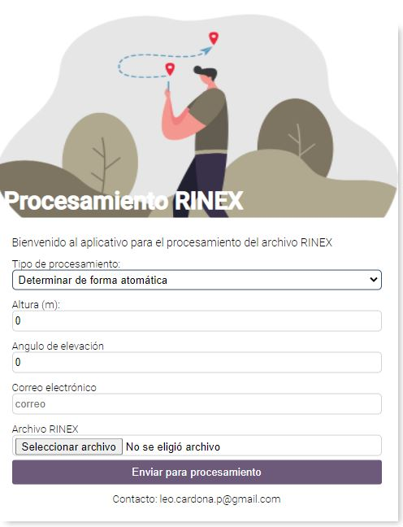

# Servicio de procesamiento de datos GPS para Colombia

COLPOS es un servicio de procesamiento de datos GPS Online que te permite realizar el procesamiento de tus datos GPS de una forma muy sencilla, a cualquier hora del día con costo cero.



Se agradece el apoyo brindado brindado por [Iván Carrillo](https://github.com/ivancvp), sus aportes fueron vitales para el desarrollo de este proyecto.

Para procesar tus datos solamente debes

1. Ingrear al sitio web https://nowsoft.app/gps/web/ recuerda que puedes ingresar desde tu celular o tu computador.

2. Debes ingresar los parámetros de procesamiento que quieres utilizar para procesar tus datos, las opciones que tienes disponibles son:
    * **Tipo de procesamiento**: Corresponde a las técnicas de procesamiento que puedes emplear para el procesamiento de tus datos. Ten en cuenta que puedes seleccionar la opción determinar de forma automática cuando desees que revisemos cual es la mejor técnica a emplear.
    * **Altura (m)**: Altura en metros de la antena GPS desde el [ARP](https://www.researchgate.net/profile/Volker_Janssen/publication/260210659/figure/fig2/AS:297233644834820@1447877431747/Antenna-reference-point-ARP-antenna-phase-centre-APC-and-its-variation-APCV.png) (Antenna Reference Point)
    * **Angulo de elevación**: Puedes aplicar un filtro para eliminar algunas observaciones GPS que no son de tu interes, por defecto utilizamos un angulo de elevación de 10 grados al procesar procesar tus datos
    * **Correo electrónico**: Como resultado del procesamiento COLPOS envia un reporte en formato PDF en el cual puedes ver el resultado de tu procesamiento. Ingresa el correo al que quieres que enviemos el reporte
    * **Archivo RINEX**: Compartenos un archivo RINEX de observación del levantamiento GPS que hayas realizado. Te dejamos un archivo RINEX de la estación GPS [BOGT](https://raw.githubusercontent.com/lacardonap/COLPOS/master/resources/bogt0590.20o) la cual hace parte de la red global de estaciones GPS de rastreo continuo.
3. Una vez hayas ingresado tus datos da clic en el botón Enviar para procesamiento y ahora solo debes esperar tus coordenadas precisas.


Recuerda que puedes ingresar al servicio de procesamiento a cualquier hora del día desde tu computador e incluso tu dispositivo móvil, unicamente necesitas contar con conexión a Internet.

Esperamos que lo disfrutes,

## Installation


1. Install dependences

```bash
npm run i
```

2. Local deploy

first run the start local deploy for modify the web app
```bash
npm run start

```

then run the backend which is deployed on port 3000

```bash
npm run nodemon

```


## Usage

run the command

```bash
npm run build

```
to create the project build in [pip](dist) folder


## Contributing
Pull requests are welcome. For major changes, please open an issue first to discuss what you would like to change.

